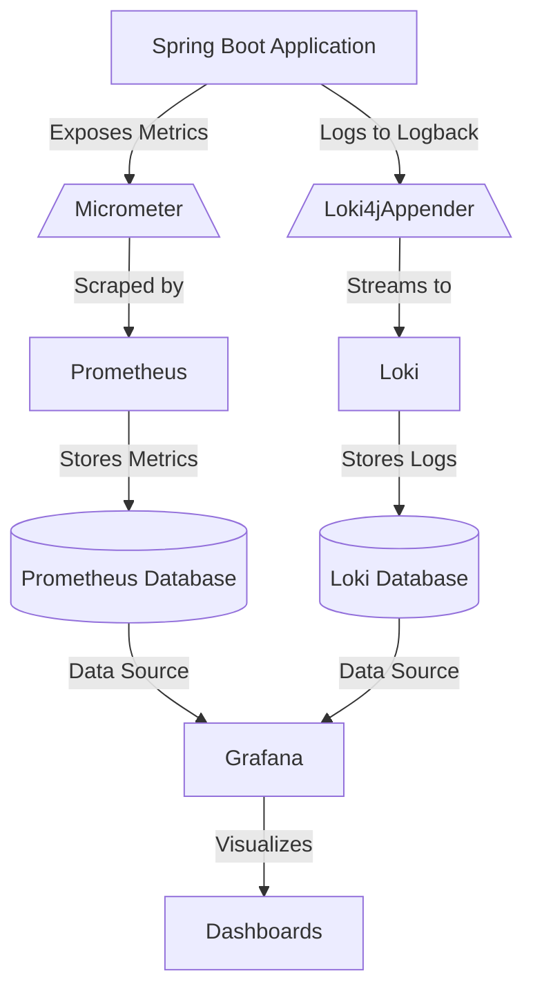

# Spring Boot Observability Demo

This repo contains a demo project providing a minimal example of getting started with Spring Boot Observability. The
entire stack is represented in a Docker Compose file, and the app creates sample test data to demonstrate
metric and log generation.

## Getting Started

The application can be run using `./mvnw spring-boot:run`, 
thanks to [Spring Boot's Docker Compose support](https://docs.spring.io/spring-boot/reference/features/dev-services.html#features.dev-services.docker-compose) 
this will boot everything needed the stack via the Docker Compose file.

The `seed-data.sh` shell script can then be used to add some sample data to Grafana dashboard, which can be viewed at http://localhost:3000/dashboards.

Data can also manually be added by calling the endpoints detailed in the seed data script directly.

## Stack Overview

Spring Boot Observability simplifies monitoring and debugging by collecting and centralizing metrics, logs, and traces.
Powered by Micrometer, it provides a unified way to gather application metrics and integrates seamlessly with various
tools like Prometheus, Loki, and Grafana.

### Micrometer

Micrometer is the backbone of metrics observability in Spring Boot, providing a vendor-neutral facade—similar to SLF4J—
for defining and exporting metrics across multiple monitoring platforms. With its integration into Spring Boot Actuator,
it automatically collects application metrics, such as JVM statistics, HTTP requests, database connections, and more.
Key features of Micrometer include:

- **Vendor-neutral**: Works seamlessly with various monitoring tools (e.g., Prometheus, Datadog, or New Relic).
- **Domain-Specific Metrics**: Allows you to define custom metrics for your application domain.
- **Built-in Instrumentation**: Includes support for out-of-the-box metrics for common components like HTTP, R2DBC,
  Hibernate, and more.

### Integration with Prometheus, Loki, and Grafana

1. **Prometheus**:
    - Prometheus is used to scrape and store time-series metrics from your Spring Boot application.
    - Micrometer provides a Prometheus registry, which when combined with Spring Actuator exposes metrics at the 
      `/actuator/prometheus` endpoint.
    - Prometheus collects data from this endpoint at regular intervals, stores the metrics, and supports querying them
      using PromQL.

2. **Loki**:
    - Loki is designed for log aggregation and works like Prometheus but for logs.
    - Logs generated by your Spring Boot application can be streamed to Loki, often using logback or other logging
      frameworks configured for JSON output.
    - The logs can then be queried and displayed using Grafana, making it easier to connect metrics with logs for
      troubleshooting.

3. **Grafana**:
    - Grafana serves as the visualization layer in the observability stack.
    - Metrics from Prometheus and logs from Loki can be visualized in dashboards.
    - Developers can create custom dashboards to monitor application performance, view trends, and correlate metrics
      with logs for streamlined debugging.

### How the Stack Works Together

1. **Application Metrics**: Spring Boot exposes built-in and custom metrics through Micrometer.
2. **Prometheus Scraping**: Prometheus scrapes the `/actuator/prometheus` endpoint and stores the metrics as time-series
   data.
3. **Log Streaming with Loki**: Logback (or other logging frameworks) streams application logs to Loki for aggregation.
4. **Visualization in Grafana**: Grafana uses Prometheus as the metrics source and Loki as the log source. Dashboards
   are configured to provide real-time insights into metrics and logs.

## Additional Resources

* [Observability with Spring Boot 3](https://spring.io/blog/2022/10/12/observability-with-spring-boot-3)
  * [With the accompanying repo](https://github.com/marcingrzejszczak/observability-boot-blog-post)
* [Spring Boot with Observability](https://github.com/blueswen/spring-boot-observability)
* [Micrometer Documentation](https://docs.micrometer.io/micrometer/reference/overview.html)
